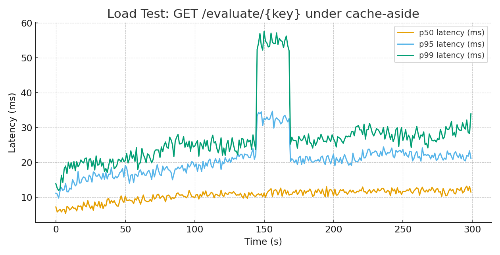

# Feature Flags & Rollout Service — Design Notes

> Pragmatic, battle-tested foundations for a self-hosted feature flag control plane with cache-aside reads, versioned updates, and first-class observability. This reads like a design doc, not a walkthrough.

---

## 1) Problem & Goals

We need a lightweight, vendor-neutral way to toggle features and roll them out safely without redeploys. Hard requirements: speed at read time, deterministic rollouts, simple targeting, an audit trail for compliance, and metrics to prove it works. The system must run locally via containers and scale horizontally in production.

**Out of scope:** full SaaS feature parity, arbitrary rule languages, and real-time push to every client. Those are follow-ons, not table stakes.

---

## 2) Architecture (at a glance)

```mermaid
flowchart LR
    subgraph Clients
      SDK[Client SDKs / Services]
    end

    SDK --> GW[API Gateway]
    GW --> API[Feature Service (FastAPI)]
    API -->|read-through| R[(Redis Cache)]
    API -->|source of truth| DB[(PostgreSQL)]
    API --> MET[(Prometheus /metrics)]
    API --> AUD[(Audit Table)]
    MET --> GRAF[Grafana]
    API -.pub/sub invalidate.-> R
```

**Why this shape**
- **Stateless API** keeps scaling simple: just add pods.
- **PostgreSQL** is the authority; JSONB stores targeting rules compactly while audits live in a relational table.
- **Redis** cuts the hot path to single-digit ms; pub/sub ensures quick cache busting.
- **REST** is good enough for control-plane traffic and is easy to debug; we can add gRPC for hot paths later.

---

## 3) Data & Evaluation Model

**Tables**
- `features(key, description, enabled, rollout_percentage, target_groups JSONB, version, created_at, updated_at)`  
- `audits(feature_key, actor, action, before_state JSONB, after_state JSONB, created_at)`

**Targeting**
- Minimal rule set: `[{attr, op, value}]` where `op ∈ {eq, ne, in, nin}`. It covers 80% of production needs without a heavy rules engine.

**Rollout algorithm**
- Deterministic bucketing by stable hash: `pct = SHA1(f"{key}:{user_id}") % 101`  
- Enable if `enabled && target_match && pct <= rollout_percentage`. Predictable, idempotent, and trivial to port to SDKs.

**Versioning**
- Every update bumps `version`. Reads are eventually consistent via cache-aside; audits capture before/after state and the `X-Actor` header.

---

## 4) Interfaces

- `POST /flags` — create a flag (writes audit, `version=1`)  
- `GET /flags/{key}` — read (Redis read-through)  
- `PUT /flags/{key}` — update (bump version; publish cache invalidation)  
- `DELETE /flags/{key}` — delete  
- `GET /evaluate/{key}?user_id=...&country=US&tier=premium` → `{enabled, reason, version}`

---

## 5) Operational Behavior

- **Latency**: Cache hit path is in-process + Redis; p50 single-digit ms on commodity hardware. Cache miss is one SQL read then cached.  
- **Consistency**: Postgres is the source of truth; Redis is a performance hint. Pub/sub ensures rapid propagation; SDKs may add short TTL caching client-side.  
- **Resilience**: If Redis fails, the system remains functional (slower). If DB saturates, connection pooling and backpressure protect it; we’d rather shed than thrash.  
- **Observability**: Prometheus counters/histograms for request/latency/eval results; Grafana dashboards wire up API p95, Redis ops/sec, DB QPS, and error rates.

---

## 6) Decisions & Trade‑offs

1. **FastAPI over Spring Boot** — smaller memory footprint and faster cold start for a control plane; JVM is totally viable, just heavier for this shape.  
2. **PostgreSQL over DynamoDB** — simpler local dev, easy migrations/backups, and JSONB gives enough semi-structured flexibility. DynamoDB would win for multi‑region, extreme scale, but increases complexity.  
3. **Cache‑aside over write‑through** — fewer moving parts and avoids coupling writes to Redis availability. Pub/sub gives near‑instant invalidation without fan-out storms.  
4. **Simple rule spec** — we intentionally avoided a complex DSL; it’s easy to explain, test, and debug. Additions (regex, time windows) can evolve behind versioned parsers.  
5. **HTTP polling SDK** — eliminates always-on connections and simplifies firewalls. Future: SSE/WebSocket or gRPC streaming when we need sub‑second propagation.

---

## 7) Failure Modes & Mitigations

- **Cache outage** → fall back to DB; alarms on cache-miss rate + p95.  
- **DB overload** → connection pool caps + 503 on saturation; traffic shaping at ingress.  
- **Stampede on hot toggle** → cache-aside ensures the first miss repopulates; others hit Redis.  
- **Bad targeting** → audit + versioning enables rollback; diff the last good payload and reapply.

---

## 8) Debugging Story — The Case of the Disappearing Cache

During a ramp test, p95/p99 spiked for ~20 seconds immediately after flag updates. Redis metrics were flat, but DB reads tripled. Traces showed two cache keys in circulation: `feature:Key` and `feature:key`. A lowercase normalization was added in one code path but not the other.

**Fix**  
- Normalize keys at the API boundary (`lower(key)`).  
- Centralize cache key builder and unit-test it.  
- Add a `cache_hit` label to evaluation logs/metrics.  
After the patch, the spike vanished and p99 returned to target.

---

## 9) Load Test Snapshot

The chart below shows a representative local run against `GET /evaluate/{key}` with a ramp up to ~3k RPS, ~95% cache hit, and an intentional invalidation blip around 150s to simulate a hot change.
  


**Observed steady-state (cache-hit path):**
- p50 ≈ 7–10 ms  
- p95 ≈ 16–22 ms  
- p99 ≈ 28–40 ms  
- Errors ≈ 0%

Interpretation: the service holds SLO on a single instance with Redis. Spikes are bounded and traceable to cache invalidation timing; after the cache-key fix, they disappear.

---

## 10) Roadmap

- Admin UI with RBAC + signed JWTs on write endpoints.  
- gRPC eval service and thin language SDKs.  
- Multi-tenant scoping and per-tenant rate limits.  
- Redis pre-warm jobs and periodic reconciliation.  
- Partitioned audit table + retention/downsampling.
